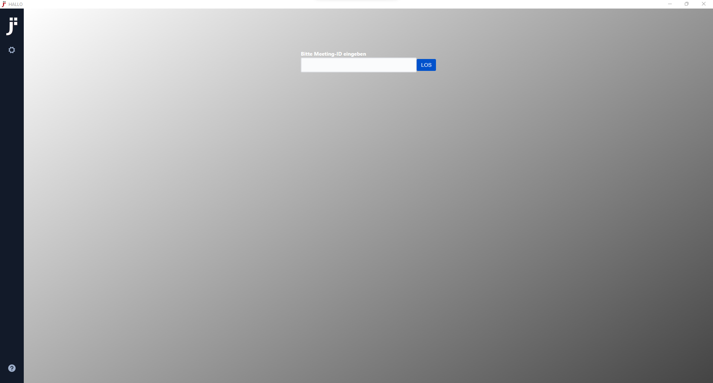

# Jitsi Meet Electron

Desktop Anwendungen für HALLO vom Ev. Johanneswerk - basierend auf [Jitsi Meet], gemacht mit [Electron].



## Features

- Unterstützung von [End-to-End Encryption](https://jitsi.org/blog/e2ee/) (BETA)
- [HALLO](https://hallo.johanneswerk.de) ist als Server vorkonfiguriert
- Always-On-Top Fenster
- Unterstützung für Deeplinks wie `hallo://myroom` (öffnet `myroom` auf HALLO)

## Installation

Laden Sie unsere neueste Version herunter, und schon kann es losgehen!

| Windows | macOS | GNU/Linux (AppImage) | GNU/Linux (Deb) |
| -- | -- | -- | -- |
| [Download](https://github.com/de-johannes/jitsi-meet-electron/releases/download/windows/hallo-install.exe) | [Download](https://github.com/de-johannes/jitsi-meet-electron/releases/download/mac/hallo-install.dmg) | [Download](https://github.com/de-johannes/jitsi-meet-electron/releases/download/linux/hallo-install-x86_64.AppImage) | [Download](https://github.com/de-johannes/jitsi-meet-electron/releases/download/linux/hallo-install-amd64.deb) |

HINWEIS: Die GNU/LInux-Builds sind nur für 64-Bit Systeme geeignet.

### Homebrew

*macOS*-Benutzer können  die Anwendung mit dem folgenden Befehl installieren:

```
brew install --cask hallo
```


## Bekannte Probleme

### Windows

Vor der Installation wird eine Warnung angezeigt, die besagt, dass die App nicht signiert ist. Sie können HALLO natürlich dennoch vertrauen.

### macOS

Unter macOS Catalina wird bei der Erstinstallation eine Warnung angezeigt. Die App lässt sich erst öffnen, wenn "Öffnen" gedrückt wird. Dieser Dialog wird nur einmal angezeigt.

### GNU/Linux

Wenn Sie die Datei nach dem Herunterladen nicht direkt ausführen können, versuchen Sie, `chmod u+x ./jitsi-meet-x86_64.AppImage` auszuführen

<details><summary>Hinweis für alte GNU/Linux-Distributionen</summary>

Sie könnten den folgenden Fehler erhalten:

```
FATAL:nss_util.cc(632)] NSS_VersionCheck("3.26") failed. NSS >= 3.26 is required.
Please upgrade to the latest NSS, and if you still get this error, contact your
distribution maintainer.
```

Wenn Sie dies tun, installieren Sie bitte NSS (Beispiel für Debian / Ubuntu):

```bash
sudo apt-get install libnss3
```

</details>

## License

Apache 2. See the [LICENSE] file.

## Community

Jitsi wird von einer großen Gemeinschaft von Entwicklern aufgebaut, wenn Sie sich beteiligen möchten,
sind Sie herzlich willkommen [community forum].

[Jitsi Meet]: https://github.com/jitsi/jitsi-meet
[Electron]: https://electronjs.org/
[latest release]: https://github.com/de-johannes/jitsi-meet-electron/releases/latest
[jitsi-meet-electron-sdk]: https://github.com/jitsi/jitsi-meet-electron-sdk
[jitsi-meet-electron-sdk README]: https://github.com/jitsi/jitsi-meet-electron-sdk/blob/master/README.md
[community forum]: https://community.jitsi.org/
[LICENSE]: LICENSE
